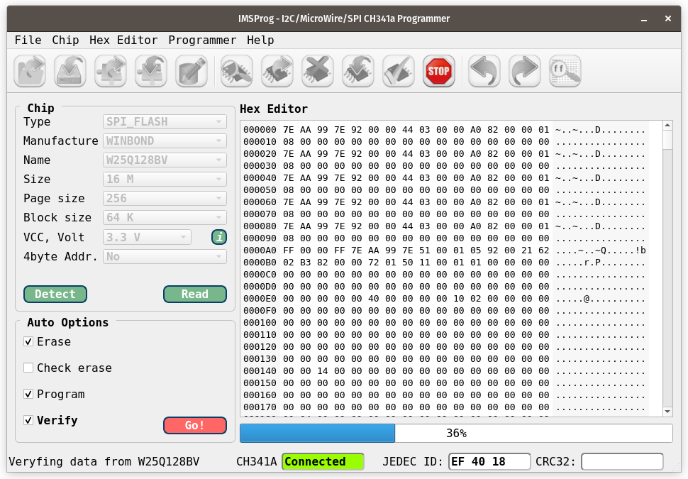

# MultiMod II Bootloader Build Instructions
These instructions assume a Linux build environment, specifically [Pop!_OS](https://pop.system76.com/). Other Linux distributions are likely sufficient if they are supported by the toolchains used herein. The author has used WSL (Windows System for Linux) as well for early exploration.

## Setup
This version begins by building the design in the `mmj1boot` directory using
the [Fomu](https://www.crowdsupply.com/sutajio-kosagi/fomu) development platform's designer-provided toolset. The tar file containing the [icestorm tools](https://github.com/im-tomu/fomu-toolchain)
should be installed in /opt/fomu-toolchain-Linux. Place its bin subdirectory
FIRST in your PATH environment variable.

```export PATH=/opt/fomu-toolchain-Linux/bin:$PATH```

Use `sudo apt install gforth` to install an old version of gforth in order  to compile the [latest Gforth](https://gforth.org) source files. The older default version of gforth works fine, though I did build the latest version from
source just in case any significant changes or improvements to gforth occurred.

## Compilation and Synthesis
Within the `mmj1boot` directory use the `compile` command script to create an initial Forth dictionary image using `compilenucleus` and using the above icestorm toolset to synthesize the J1A CPU design. An unrecognized option appears in the first command in the compile script that invokes
yosys, the `-noabc9` option. The build completes successfully with this option removed.

The script needs a seed value when invoking the `nextpnr-ice40` place and route program. The value used (11) was determined by successively trying values, starting with 1, until a seed was found that allowed synthesis to complete with all clock constraints satisfied. At the end of the build the bitstream file `j1a.dfu` will appear in the `mmj1boot` directory.

Within the *build* directory will be found the `j1a.bin` and `multiboot.bin` files. These binary files can be used to program flash memory on the MultiMod II board. The `multiboot.bin` file incorporates both this bootloader bitstream and the production bitstream configuration as the second image.

***

## Development Testbed
Developing the Forth code to support interaction with the FPGA and the external SPI flash memory can be done with a development environment that replicates some of the MultiMod II physical board. One such testbed is the [Fomu](https://github.com/im-tomu/fomu-hardware) development board that fits in a USB slot.

Using the **Fomu** testbed:

Run ```./compile``` in the ```fomu``` subdirectory to build a new bitstream image.

Run ```sudo /opt/fomu-toolchain-Linux/bin/dfu-util -l``` to list the attached DFU device(s) identification status.

Run ```sudo /opt/fomu-toolchain-Linux/bin/dfu-util -D j1a.dfu``` in the fomu subdirectory to load the newly built bitstream image. You may need to supply the vendor and device id as parameters to the command if more than one DFU capable device is attached. I recommend having only the Fomu attached to avoid confusion or mistake.

Run ```sudo /opt/fomu-toolchain-Linux/bin/dfu-util -e``` in the fomu subdirectory.

Run ```sudo dmesg | grep tty``` to identify the tty to which Fomu is attached. By default it should be /dev/ttyACM0```

### Communication

Use ```minicom -b 115200 -D /dev/ttyACM0``` to connect to the Forth CPU. Note that you'll need to add yourself to the dialout group. An alternative terminal program is GTKTerm, which is more easily configurable.

Invoke minicom communication (control-A Z) then set lineWrap on/off (control-A Z W) followed by Add Carriage Ret (control-A Z U). Set the comm parameters to 8N2 (control-A Z P X). You'll need to add some delay to each character sent by minicom to the Forth console via the terminal settings (control-A Z T). Set the character send delay to 1 milliseconds and the line end delay to 50 milliseconds. **The same character delay will be needed by other terminal emulators, such as TeraTerm.**

***For the above settings to work properly, use the `dint` command at the start of your working session to disable interrupts.***

---

---
Note: to avoid using sudo each time you run *dfu-util*, you can change the permissions for the usb device. First, identify the device using the lsusb command

```
lsusb
Bus 004 Device 001: ID 1d6b:0003 Linux Foundation 3.0 root hub
Bus 003 Device 113: ID 1209:5bf0 Generic Fomu PVT running DFU Bootloader v2.0.3
Bus 003 Device 111: ID 0c45:7692 Microdia USB Keyboard
Bus 003 Device 110: ID 045e:0773 Microsoft Corp. Microsoft® Nano Transceiver v1.0
Bus 003 Device 112: ID 1209:2211 Generic Mathpad
Bus 003 Device 109: ID 1a40:0101 Terminus Technology Inc. Hub
Bus 003 Device 004: ID 8087:0033 Intel Corp. 
Bus 003 Device 098: ID 0483:5740 STMicroelectronics Virtual COM Port
Bus 003 Device 001: ID 1d6b:0002 Linux Foundation 2.0 root hub
Bus 002 Device 001: ID 1d6b:0003 Linux Foundation 3.0 root hub
Bus 001 Device 001: ID 1d6b:0002 Linux Foundation 2.0 root hub
```

The device is identified as **Generic Fomu PVT running DFU Bootloader v2.0.3**. Note the Bus and Device numbers. For the above example, go to /dev/bus/usb/003,
then do a chmod 0777 113 to give permissions to all. From there, you can run *dfu_util* as a regular user.

## Production Build
To build a bitstream image for the MultiMod II board itself, change to the ```mmj1boot``` subdirectory then execute the *./compile* script. Use the `build/multiboot.bin` file to program the MultiMod II flash memory.

### MultiMod II Board Programming With The CH341A
First, if not already present, install IMSProg using the commands

```
sudo add-apt-repository ppa:bigmdm/imsprog
sudo apt update
sudo apt install imsprog
```


Using the programming adapter board, connect the header cable to the MultiMod II header and to the programming adapter board. The red orientation stripe should be at the top of the MultiMod II header and at the top of the programming board header. Put the pins of the adapter board in the lower half of the CH431A programmer socket, then plug the programmer into a USB socket. The programmer presence can be verified with the `lsusb` command and should appear similarly to that below.

```
Bus 003 Device 053: ID 1a86:5512 Qin Heng Electronics CH341 in EPP/MEM/I2C mode, EPP/I2C adapter
```

The following command will bring up the program utility GUI (be sure you are in the `dialout` group)

```
IMSProg
```

Pressing the `Detect` button should show the Winbond 16 MB SPI flash device with JEDEC ID EF 40 18. Use the Open button to read in the `multiboot.bin` file, then press Go to program the bootloader into flash.

